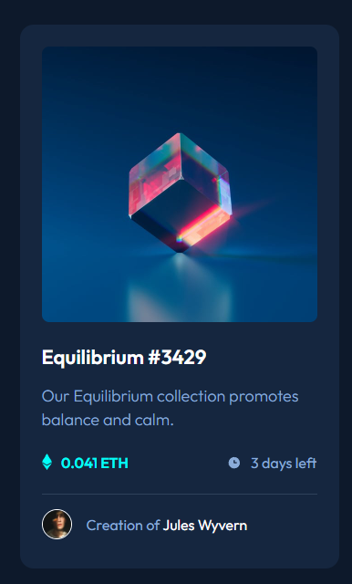
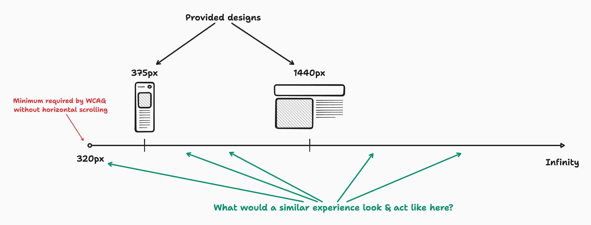

# Frontend Mentor - NFT preview card component solution

This is a solution to the [NFT preview card component challenge on Frontend Mentor](https://www.frontendmentor.io/challenges/nft-preview-card-component-SbdUL_w0U). Frontend Mentor challenges help you improve your coding skills by building realistic projects.

## Table of contents

- [Overview](#overview)
  - [The challenge](#the-challenge)
  - [Screenshot](#screenshot)
  - [Links](#links)
- [My process](#my-process)
  - [Built with](#built-with)
  - [What I learned](#what-i-learned)

**Note: Delete this note and update the table of contents based on what sections you keep.**

## Overview

### The challenge

Users should be able to:

- View the optimal layout depending on their device's screen size
- See hover states for interactive elements

### Screenshot

<details>

<summary>Click to open</summary>



</details>

### Links

- Live Site URL: [Live](https://solracss.github.io/FrontendMentor-nft-card/)

## My process

### Built with

<div >
	
	
	
	
</div>

### What I learned

1. How to set image as button:

```html
<button class="btn-overlay" aria-label="preview item">
	
</button>
```

```css
.btn-overlay {
	display: block;
	position: relative;
	overflow: hidden;
	border-radius: 8px;
}
```

2. How to use pseudo elements `::before` and `::after` for button hover overlay

```css
.btn-overlay::after,
.btn-overlay::before {
	content: "";
	position: absolute;
	opacity: 0;
	width: 100%;
	height: 100%;
	transition: opacity 0.3s ease-out;
}

.btn-overlay::after {
	top: 0;
	left: 0;
	background-color: rgba($cyan, 0.5);
	z-index: 1;
}

.btn-overlay::before {
	background-image: url("../images/icon-view.svg");
	background-position: center;
	background-repeat: no-repeat;
	z-index: 2;
}

.btn-overlay:hover::after,
.btn-overlay:hover::before {
	opacity: 1;
}
```

3. Buttons are inline elements so they have `line-height`. In order to avoid having bottom gap below them we need to set `display:block.

4. How to work with `@media` and think how my site would behave depending on what screen it will be displayed.

```css
.wrapper {
	max-width: rem(327px);
    ...
}

@media (min-width: rem(600px)) {
	.wrapper {
		max-width: rem(350px);
        ...
	}
```



5. Instead of using `padding` for creating space we can use `gap` property.

6. For line separation it's good to avoid empty `<div>` and use `<hr>`.

7. Decorative icons do not need to have `alt`.

8. `<footer>` are contentinfo role for a webpage, so would contain repeating content across a whole site.

9. `<button>` should have accessible name.
